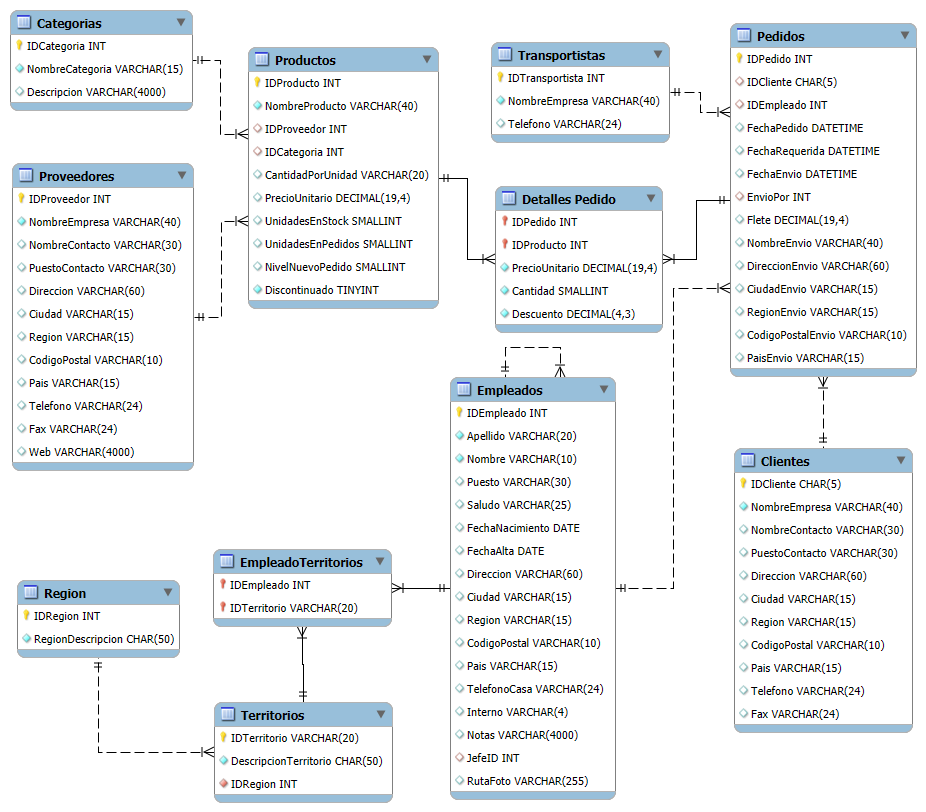

# Pampero


Base de datos de ejemplo Pampero, adaptación en español del clásico esquema Northwind.

## Diagrama de tablas



Incluye scripts para:
- crear la base,
- generar tablas, claves e índices,
- cargar datos,
- validar integridad por cantidad de registros y checksum (CRC/MD5),

## Motores soportados

- MySQL
- PostgreSQL
- SQL Server

## Estructura del repositorio

```text
MySQL/
	pamperomysql.sql
	pamperomysql.test.sql

PostgreSQL/
	pamperopostgre.sql
	pamperopostgre.test.sql
	Docker/
		Dockerfile

SQLServer/
	pamperomssql.sql
	pamperomssql.test.sql
```

## Requisitos

- Cliente de base de datos para ejecutar scripts (`mysql`, `psql`, `sqlcmd` o equivalente GUI).
- Permisos para crear base de datos y objetos.

## Compatibilidad de versiones

| Motor | Mínima compatible | Última estable recomendada | Motivo técnico principal |
|---|---:|---:|---|
| MySQL | 8.0 | 9.6 | Se usa la collation `utf8mb4_es_0900_ai_ci` (familia 0900 de MySQL 8). |
| PostgreSQL | 12 | 18 | Los scripts usan PL/pgSQL (`DO $$`), funciones y checks estándar; el locale depende del SO. |
| SQL Server | 2019 | 2025 | Se usa collation UTF-8 `Modern_Spanish_100_CI_AI_SC_UTF8` (soporte formal en SQL Server 2019+). |

Notas por motor:
- MySQL usa collation `utf8mb4_es_0900_ai_ci`.
- PostgreSQL crea la base con locale `es_ES.utf8`.
- SQL Server crea la base con collation `Modern_Spanish_100_CI_AI_SC_UTF8`.

## Orden recomendado de ejecución

### 1) MySQL

1. Crear esquema y cargar datos:

```bash
mysql -u root -p < MySQL/pamperomysql.sql
```

2. Ejecutar control de integridad:

```bash
mysql -u root -p < MySQL/pamperomysql.test.sql
```

### 2) PostgreSQL

1. Crear esquema y cargar datos:

```bash
psql -U postgres -f PostgreSQL/pamperopostgre.sql
```

2. Ejecutar control de integridad:

```bash
psql -U postgres -f PostgreSQL/pamperopostgre.test.sql
```

Si tu entorno no tiene locale español, hay un Dockerfile en `PostgreSQL/Docker/` para generar `es_ES.utf8`.

### 3) SQL Server

1. Crear esquema y cargar datos:

```bash
sqlcmd -S <servidor> -U <usuario> -P <password> -i SQLServer/pamperomssql.sql
```

2. Ejecutar control de integridad:

```bash
sqlcmd -S <servidor> -U <usuario> -P <password> -i SQLServer/pamperomssql.test.sql
```

## Validación esperada

Los scripts `*.test.sql` comparan:
- cantidad de registros por tabla,
- checksum MD5 acumulado por tabla.

Una carga correcta debe devolver resultado `OK` en controles de CRC y cantidad.

## Troubleshooting

### MySQL

Error común: `Unknown collation: 'utf8mb4_es_0900_ai_ci'`
- Causa probable: versión de MySQL anterior a 8.0.
- Solución: usar MySQL 8.0+ o reemplazar temporalmente el collation por uno disponible (por ejemplo `utf8mb4_general_ci`).

Error común: `ERROR 1044 (42000): Access denied ... to database 'Pampero'`
- Causa probable: el usuario no tiene permisos para crear o eliminar bases.
- Solución: ejecutar con un usuario administrador o pedir permisos `CREATE`, `DROP`, `ALTER`, `INDEX`, `INSERT`, `SELECT` sobre la base.

Error común: `Unknown database 'Pampero'` al correr `pamperomysql.test.sql`
- Causa probable: no se ejecutó antes `MySQL/pamperomysql.sql` o falló durante la creación.
- Solución: ejecutar primero el script principal y luego el de test.

### PostgreSQL

Error común: `invalid locale name: "es_ES.utf8"`
- Causa probable: el locale no existe en el sistema operativo/contenedor.
- Solución: generar el locale en el host o usar el Dockerfile de `PostgreSQL/Docker/` que lo configura.

Error común: `FATAL: role "postgres" does not exist`
- Causa probable: el servidor usa otro rol administrador.
- Solución: ejecutar `psql` con un rol válido del entorno (`-U <rol_admin>`).

Error común: `database "pampero" does not exist` al correr `pamperopostgre.test.sql`
- Causa probable: no se ejecutó o falló `PostgreSQL/pamperopostgre.sql`.
- Solución: correr nuevamente el script principal y verificar que no haya errores antes del test.

### SQL Server

Error común: `Cannot open database "Pampero" requested by the login`
- Causa probable: la base no se creó o el login no tiene acceso.
- Solución: ejecutar primero `SQLServer/pamperomssql.sql` con un login con permisos de creación y luego otorgar acceso al usuario.

Error común: `Cannot resolve collation conflict` o collation no soportado
- Causa probable: edición/versión de SQL Server sin soporte para `Modern_Spanish_100_CI_AI_SC_UTF8`.
- Solución: usar SQL Server 2019+ o adaptar el collation del `CREATE DATABASE` a uno compatible en ese servidor.

Error común: falla en funciones usadas por el test (`CONCAT_WS`, `HASHBYTES`)
- Causa probable: compatibilidad de versión o nivel de compatibilidad de la base.
- Solución: usar SQL Server moderno (recomendado 2019+) y validar el compatibility level de la base.

### Diagnóstico rápido

Si un test falla por CRC o cantidad:
1. Re-ejecutar el script principal del motor desde una base limpia.
2. Verificar que no haya errores intermedios en la consola.
3. Recién después ejecutar el `*.test.sql`.
